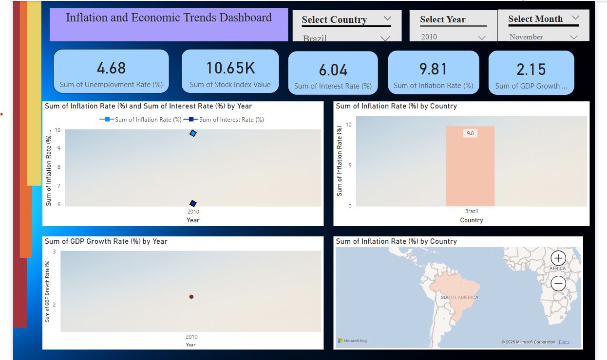
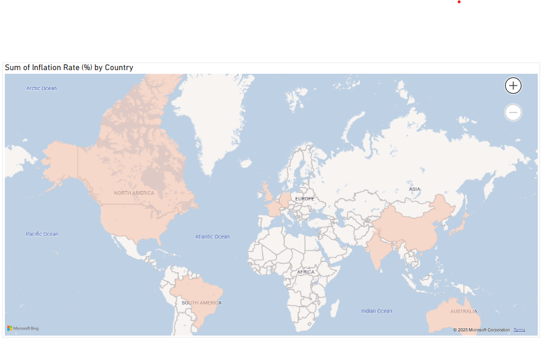
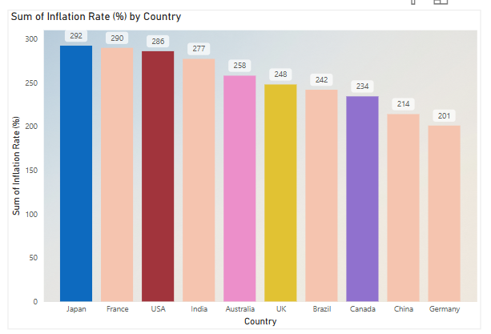
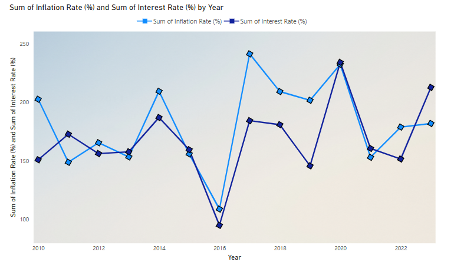

# 📊 Inflation & Economic Trends Dashboard — Power BI

> 🎯 **Track global economic health** with this beautifully animated, interactive dashboard — analyzing key macroeconomic indicators like **Inflation**, **Interest Rate**, **GDP Growth**, and **Unemployment** from 2010 to 2023 across major countries.

> 🌍 **Explore patterns, compare countries**, and uncover trends that shape economies — all in one responsive Power BI experience.

---

## ✨ What Makes This Dashboard Special?

🎨 Visually rich.  
⚡ Interactive.  
📈 Insight-driven.  
💼 Business-ready.

This isn’t just a static report — it's an **immersive experience** for **economists**, **data analysts**, **students**, and **policy advisors**.

---

## 🔎 Explore Key Economic Trends Like Never Before

| 🔹 Indicator                   | 📊 Visualization Used                            | 🤔 Insights You Can Draw                     |
|-------------------------------|---------------------------------------------------|----------------------------------------------|
| **Inflation Rate (%)**        | KPI + Line Chart + Country Bar                   | How inflation changed year over year         |
| **Interest Rate (%)**         | Line Chart + KPI Comparison                      | Central bank policy trends                   |
| **GDP Growth (%)**            | Column & Scatter Chart                           | Economic boom/recession periods              |
| **Unemployment Rate (%)**     | Combined with GDP to detect inverse correlation  | Job market stress vs. GDP performance        |
| **Stock Index Value**         | Line trend with country filter                   | Market performance during key events         |

🧠 *Each chart updates dynamically with slicers – revealing localized insights and correlations.*

---

## 🎛️ Interactivity That Delivers

| Component                  | Functionality                                 |
|----------------------------|-----------------------------------------------|
| 🌐 **Country Slicer**       | Instantly switch between countries            |
| 📅 **Year & Month Slicers** | View trends across time                       |
| 📌 **Animated Navigation**  | Dropdowns, smooth transitions, hover effects  |
| 📉 **Responsive Layout**    | Clean auto-alignment, even on small screens   |

---

## 📸 Dashboard Walkthrough

### 🧠 Full Dashboard Overview

---

### 📈 Inflation vs Interest Rate (Time Series Insight)

> 🧩 *Watch how inflation and interest rates dance — see central bank reactions in real time!*

---

### 🌍 Global Heatmap of Inflation

> ✨ *Color-coded intensity shows where inflation hits hardest across the globe.*

---

## 📂 Dataset Summary

| Feature             | Details                                                  |
|---------------------|-----------------------------------------------------------|
| 📄 **File Name**     | `economic_indicators_dataset_2010_2023.csv`              |
| 🌐 **Source**        | Simulated macroeconomic data for visualization purposes  |
| 📅 **Years Covered** | 2010 to 2023                                              |
| 🧾 **Columns**       | Date, Country, Inflation %, Interest %, GDP %, Unemployment %, Stock Index |

---

## 🧠 Insights You’ll Walk Away With

✅ Which countries had **spiking inflation** in specific years?  
✅ Did **interest rate hikes** cool down inflation?  
✅ Is there a **clear link** between GDP growth and unemployment?  
✅ How did **global markets** react during downturns?

All visualized through an intuitive, scrollable Power BI experience.

---

## 🛠️ Built With

| Tool                | Purpose                                        |
|---------------------|------------------------------------------------|
| 🧮 **Power BI Desktop** | Core dashboard building, styling, visuals     |
| ⚙️ **Power Query**     | Data cleaning, transformation                  |
| 🧾 **DAX**              | KPIs, percentage changes, calculated fields   |
| 🎨 **Custom Design**    | Gradient headers, button slicers, animations |

---

## ⚙️ Setup Instructions

1. 🔽 **Download or clone** this repository.
2. 📂 Open the `.pbix` file using **Power BI Desktop**.
3. 🎛️ Interact with slicers for **country**, **year**, and **month**.
4. 📈 Explore how **each macroeconomic indicator** evolves over time.

💡 *No coding required — just explore the data with clicks!*

---

## 📚 What I Learned Building This

- Mastered **Power BI storytelling** using clean UX/UI
- Implemented **time intelligence** using DAX
- Built relationships between economic variables
- Applied real-world domain knowledge to visual design
- Created **dynamic filters** and slicer panels using bookmarks

---

## 🧩 What's Coming Next?

🔮 **Forecasting Trends** using built-in analytics  
🌐 **Live Data Integration** via World Bank & IMF APIs  
🗺️ **Drill-through Pages** for country-specific deep dives  
📱 **Mobile-optimized View** for Power BI Mobile App

---

## 🙌 Credits & Timeline

- 👨‍💻 Designed & Developed by: [Your Name]  
- 📅 Built: **July 2025**  
- 🧠 Inspired by real-world macroeconomic dashboards  
- 💡 Built with: **Power BI Desktop**

---

## 📎 License

Licensed under the [MIT License](LICENSE)

---

## ⭐ Like What You See?

If this project inspired or helped you, consider:

🌟 **Starring** the repo  
🍴 **Forking** it for your own country-specific dashboard  
📣 **Sharing** it with your data circle

---

## 💬 Let’s Connect!

🔗 [LinkedIn](#) | [GitHub](#) | [Email](#)

---

> 🧠 *"Data tells a story. Visualizing it makes the story speak."*
